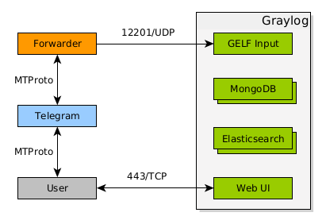
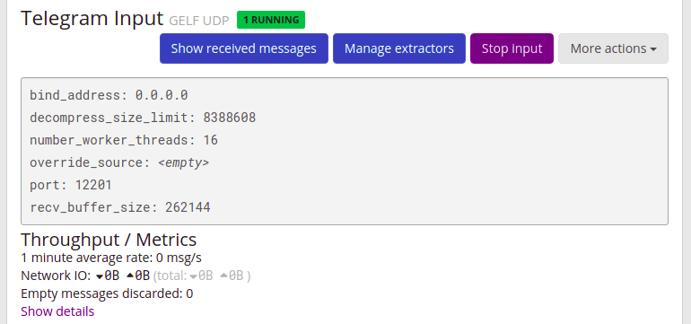
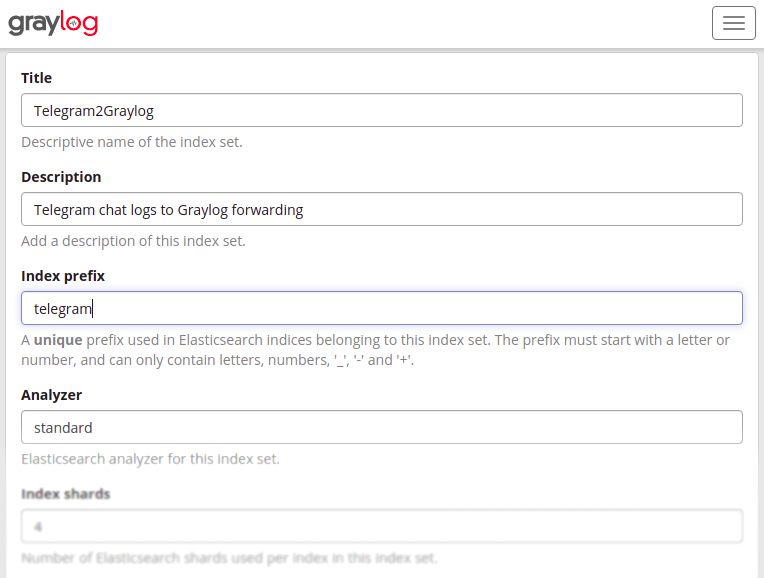
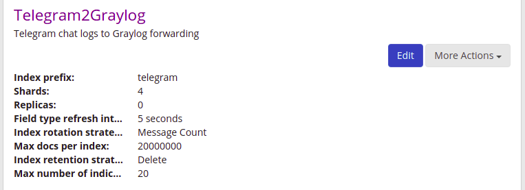
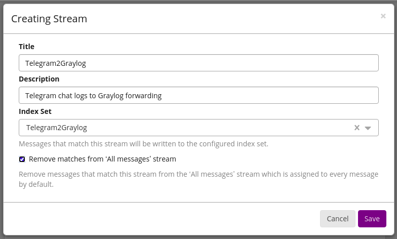
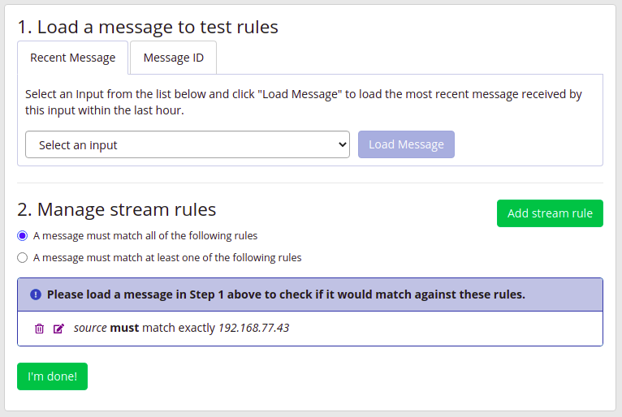
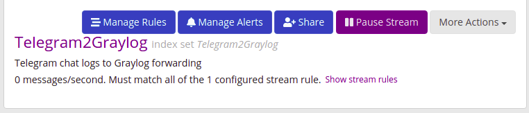
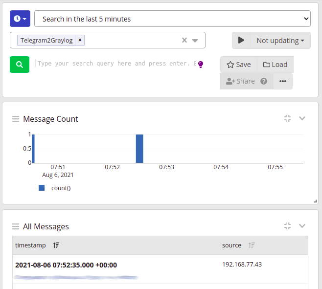

# Telegram to Graylog forwarder

## Table of Contents
  * [Architecture](#architecture)
  * [Prerequisites](#prerequisites)
  * [Usage](#usage)
    + [Realtime mode](#realtime-mode)
    + [History mode](#history-mode)
    + [Running with Docker Compose](#running-with-docker-compose)
  * [Graylog Settings](#graylog-settings)
  * [References](#references)

The [Graylog](https://docs.graylog.org/en/latest/index.html) <sup id="a1">[1](#f1)</sup> can be used for analysis of [Telegram](https://telegram.org/) <sup id="a2">[2](#f2)</sup> chat logs. To forward messages from selected chat(s) the specific Python script as transport is implemented.

## Architecture
Overall integration architecture of the solution is very simple:



The script connects to Telegram using API ID and API Hash for existing account. It can also be easily modified to run with Telegram bot credentials as used library supports this feature.

## Prerequisites
 * Install [Graylog](https://docs.graylog.org/en/latest/index.html) <sup id="a1">[1](#f1)</sup>
 * Install [Python 3](https://www.python.org/downloads/) <sup id="a3">[3](#f3)</sup>
 * Install [telethon](https://docs.telethon.dev/en/latest/) <sup id="a4">[4](#f4)</sup> module for Python 3, the MTProto library to interact with Telegram's API
 * Create your own [credentials](https://core.telegram.org/api/obtaining_api_id) <sup id="a5">[5](#f5)</sup>

## Usage
The forwarder script has been designed to run in interactive or service approach. It also supports `history` and `realtime` modes:
 * `history` mode will collect users text messages from selected chats, convert to [GELF](https://docs.graylog.org/en/latest/pages/gelf.html) <sup id="a6">[6](#f6)</sup> format and immediately send to Graylog input.

   > *Note*: This mode works within a single thread and doesn't parallelize message processing to not overload Graylog GELF input's queue. It can cause long time delivery of requested messages for chats with a very long history.

 * `realtime` mode listens for new text messages from chats which were provided as list of peers, converts each message to GELF format and immediately sends it to Graylog input.

   > *Note*: Script will process all available chats if the list is not provided.

Available arguments are:
  * `--phone PHONE`<br/>`-ph PHONE`

    Registered phone number. `CHATLOG2GRAYLOG_PHONE` environment variable will also work.

    Default: **0**
  * `--api-id API_ID`<br/>`-id API_ID`

    Telegram API ID. `CHATLOG2GRAYLOG_API_ID` environment variable will also work.

    Default: **0**
  * `--api-hash API_HASH`<br/>`-hash API_HASH`

    Telegram API Hash. `CHATLOG2GRAYLOG_API_HASH` environment variable will also work.

    Default: **not set**
  * `--until UNTIL`<br/>`-u UNTIL`

    Datetime in format `YYYY-MM-DD`. `CHATLOG2GRAYLOG_UNTIL` environment variable will also work.

    Default: **not set**
  * `--verbose`<br/>`-v`

    Enable verbose output. `CHATLOG2GRAYLOG_LOG_LEVEL` environment variable will also work.

    Default: **0**
  * `--mode {realtime,history}`<br/>`-m {realtime,history}`

    Operating mode, constaints are `realtime` and `history`. `CHATLOG2GRAYLOG_MODE` environment variable will also work.

    Default: **realtime**
  * `--graylog-host GRAYLOG_HOST`<br/>`-gh GRAYLOG_HOST`

    Graylog host to forward messages. `CHATLOG2GRAYLOG_HOST` environment variable will also work.

    Default: **not set**
  * `--graylog-port GRAYLOG_PORT`<br/>`-gp GRAYLOG_PORT`

    Graylog GELF input port. `CHATLOG2GRAYLOG_GRAYLOG_PORT` environment variable will also work. Default: 12201

    Default: **12201**
  * `--peers PEERS [PEERS ...]`<br/>`-p PEERS [PEERS ...]`

    List of chat peer IDs for realtime mode. `CHATLOG2GRAYLOG_PEERS` environment variable will also work.

    Default: **not set**


### Realtime mode
The example on how to execute the script wordy for `realtime` mode:
```
$ ./telegram_chatlog2graylog.py --phone 79123456789 --api-id 123456 --api-hash a622ddd7244a59b9c12be4e762a133df --graylog-host 192.168.77.42 -vv
[2021-08-05 01:42:19,232] DEBUG: Running Mode: realtime
[2021-08-05 01:42:19,233] DEBUG: Using selector: EpollSelector
[2021-08-05 01:42:19,234] INFO: Connecting to 149.154.167.51:443/TcpFull...
[2021-08-05 01:42:19,234] DEBUG: Connection attempt 1...
[2021-08-05 01:42:19,292] DEBUG: Connection success!
[2021-08-05 01:42:19,293] DEBUG: Starting send loop
[2021-08-05 01:42:19,293] DEBUG: Starting receive loop
[2021-08-05 01:42:19,293] INFO: Connection to 149.154.167.51:443/TcpFull complete!
[2021-08-05 01:42:19,305] DEBUG: Waiting for messages to send...

... omitted for brevity ...

[2021-08-05 01:42:19,567] DEBUG: Assigned msg_id = 6992709009337356152 to MsgsAck (7fb28bdf91c0)
[2021-08-05 01:42:19,567] DEBUG: Encrypting 1 message(s) in 36 bytes for sending
[2021-08-05 01:42:19,567] DEBUG: Encrypted messages put in a queue to be sent
[2021-08-05 01:42:19,567] DEBUG: Waiting for messages to send...
[2021-08-05 01:42:19,637] DEBUG: Handling RPC result for message 6992709009331908764
[2021-08-05 01:42:19,637] DEBUG: Receiving items from the network...

...
```

### History mode
The another example for verbosely execution in `history` mode:
```
$ ./telegram_chatlog2graylog.py --phone 79123456789 --api-id 123456 --api-hash a622ddd7244a59b9c12be4e762a133df --graylog-host 192.168.77.42 --mode history --until 1970-01-01 -vv
[2021-08-05 01:47:46,290] DEBUG: Running Mode: history
[2021-08-05 01:47:46,291] DEBUG: Using selector: EpollSelector
[2021-08-05 01:47:46,293] INFO: Connecting to 149.154.167.51:443/TcpFull...
[2021-08-05 01:47:46,293] DEBUG: Connection attempt 1...
[2021-08-05 01:47:46,349] DEBUG: Connection success!
[2021-08-05 01:47:46,349] DEBUG: Starting send loop
[2021-08-05 01:47:46,349] DEBUG: Starting receive loop
[2021-08-05 01:47:46,349] INFO: Connection to 149.154.167.51:443/TcpFull complete!
[2021-08-05 01:47:46,366] DEBUG: Waiting for messages to send...

... omitted for brevity ...

0. [All Peers]
1. chat1 (Peer 1012345678)
2. chat2 (Peer 1087654321)

[INPUT] Choose chat: 1
[2021-08-05 01:47:50,584] INFO: Chosen: chat1
[2021-08-05 01:47:50,585] INFO: Peer: chat1
[2021-08-05 01:47:50,585] INFO: Getting messages from peer 1012345678 until the date 1970-01-01 00:00:00...
[2021-08-05 01:47:50,686] DEBUG: Assigned msg_id = 6992710431449439264 to SearchRequest (7f0ff65658b0)

... omitted for brevity ...

[2021-08-05 01:47:50,945] DEBUG: Handling RPC result for message 6992710431449439264
[2021-08-05 01:47:50,959] DEBUG: Receiving items from the network...
[2021-08-05 01:47:50,961] INFO: Received: 100 messages. Offset: 0.
[2021-08-05 01:47:51,062] DEBUG: Assigned msg_id = 6992710433248198368 to SearchRequest (7f0ff65658e0)
[2021-08-05 01:47:51,063] DEBUG: Encrypting 1 message(s) in 80 bytes for sending
[2021-08-05 01:47:51,063] DEBUG: Encrypted messages put in a queue to be sent
[2021-08-05 01:47:51,064] DEBUG: Waiting for messages to send...

... omitted for brevity ...

[2021-08-05 01:47:51,204] INFO: Received: 100 messages. Offset: 100.
[2021-08-05 01:47:51,305] DEBUG: Assigned msg_id = 6992710434221231320 to SearchRequest (7f0ff6507130)
[2021-08-05 01:47:51,306] DEBUG: Encrypting 1 message(s) in 80 bytes for sending
[2021-08-05 01:47:51,307] DEBUG: Encrypted messages put in a queue to be sent
[2021-08-05 01:47:51,307] DEBUG: Waiting for messages to send...

... omitted for brevity ...

[2021-08-05 01:47:51,479] INFO: Received: 100 messages. Offset: 200.

... omitted for brevity ...

[2021-08-05 01:50:49,650] INFO: Send messages one by one: 192.168.77.1 via 12201/UDP
[2021-08-05 01:50:49,653] DEBUG: New raw message: Message(id=1234567, peer_id=PeerChannel(channel_id=1012345678), date=datetime.datetime(2021, 8, 4, 6, 12, 31, tzinfo=datetime.timezone.utc), message="@Username's rating is now 42", out=False, mentioned=False, media_unread=False, silent=False, post=False, from_scheduled=False, legacy=False, edit_hide=False, pinned=False, from_id=PeerUser(user_id=30123456), fwd_from=None, via_bot_id=None, reply_to=None, media=None, reply_markup=None, entities=[MessageEntityMention(offset=0, length=17)], views=None, forwards=None, replies=MessageReplies(replies=0, replies_pts=272769, comments=False, recent_repliers=[], channel_id=None, max_id=None, read_max_id=None), edit_date=None, post_author=None, grouped_id=None, restriction_reason=[], ttl_period=None)
[2021-08-05 01:50:49,654] DEBUG: Assigned msg_id = 6992711200120490572 to GetUsersRequest (7f934d04e100)
[2021-08-05 01:50:49,655] DEBUG: Encrypting 1 message(s) in 44 bytes for sending
[2021-08-05 01:50:49,656] DEBUG: Encrypted messages put in a queue to be sent
[2021-08-05 01:50:49,656] DEBUG: Waiting for messages to send...

... omitted for brevity ...

[2021-08-05 01:50:49,786] DEBUG: Sending parsed message: {'version': '1.1', 'channel_title': 'chat1', 'channel_id': -1001012345678, 'sender_id': 30123456, 'sender_username': 'someunknownbot', 'sender_firstname': 'Bot', 'sender_lastname': None, 'timestamp': 1628057551, 'message_id': 1234567, 'full_message': "@Username's rating is now 42", 'short_message': "@Username's rating is now 42", 'host': '192.168.77.42'} to 192.168.77.42:12201

...
```

### Running with Docker Compose
You can simply run script as service by [Docker Compose](https://docs.docker.com/compose/) <sup id="a7">[7](#f7)</sup>. Directory structure:

```bash
...

├── .env
├── chatlog2graylog_source
│   ├── build
│   │   ├── Dockerfile
│   │   └── telegram_chatlog2graylog.py
│   └── chatlog2graylog-config
└── docker-compose.yaml
```
A part of sample `docker-compose.yaml` where container with Telegram chat log to Graylog service is defined:

```yaml
...

services:

... omitted for brevity ...

  telegram_chatlog2graylog:
    container_name: telegram_chatlog2graylog
    build:
      context: chatlog2graylog_source
      dockerfile: /path/to/chatlog2graylog_source/build/Dockerfile
    restart: unless-stopped
    networks:
      networkname:
        ipv4_address: 192.168.77.43
    environment:
      CHATLOG2GRAYLOG_PHONE: ${CHATLOG2GRAYLOG_PHONE}
      CHATLOG2GRAYLOG_API_ID: ${CHATLOG2GRAYLOG_API_ID}
      CHATLOG2GRAYLOG_API_HASH: ${CHATLOG2GRAYLOG_API_HASH}
      CHATLOG2GRAYLOG_GRAYLOG_HOST: ${CHATLOG2GRAYLOG_GRAYLOG_HOST}
      CHATLOG2GRAYLOG_LOG_LEVEL: ${CHATLOG2GRAYLOG_LOG_LEVEL}
    volumes:
      - /path/to/chatlog2graylog_source/chatlog2graylog-config/telegram_chatlog2graylog.session:/tmp/telegram_chatlog2graylog.session

...
```
The [.env](https://docs.docker.com/compose/environment-variables/) <sup id="a8">[8](#f8)</sup> file:
```bash
...

# Telegram Chatlog to Graylog
CHATLOG2GRAYLOG_PHONE=79123456789
CHATLOG2GRAYLOG_API_ID=123456
CHATLOG2GRAYLOG_API_HASH=a622ddd7244a59b9c12be4e762a133df
CHATLOG2GRAYLOG_GRAYLOG_HOST=192.168.77.42
CHATLOG2GRAYLOG_LOG_LEVEL=0

...
```
[Dockerfile](https://docs.docker.com/engine/reference/builder/) <sup id="a9">[9](#f9)</sup> content:
```docker
FROM alpine:latest

RUN apk --update add python3 py3-pip && pip3 install telethon

COPY build/telegram_chatlog2graylog.py /usr/local/bin/

CMD ["python3","/usr/local/bin/telegram_chatlog2graylog.py"]
```

Before script can work as service, to create a session file is required. How to start:
* Invoke `docker-compose build` to build the image:
  ```bash
  $ docker-compose build
  ...

  Building telegram_chatlog2graylog
  Step 1/4 : FROM alpine:latest
  ---> d4ff818577bc
  Step 2/4 : RUN apk --update add python3 py3-pip && pip3 install telethon
  ---> Running in cfaa6badf7f6
  fetch https://dl-cdn.alpinelinux.org/alpine/v3.14/main/x86_64/APKINDEX.tar.gz
  fetch https://dl-cdn.alpinelinux.org/alpine/v3.14/community/x86_64/APKINDEX.tar.gz
  (1/38) Installing libbz2 (1.0.8-r1)

  ... omitted for brevity ...

  Successfully installed pyaes-1.6.1 pyasn1-0.4.8 rsa-4.7.2 telethon-1.23.0
  Removing intermediate container cfaa6badf7f6
  ---> b1b28d71ec0d
  Step 3/4 : COPY build/telegram_chatlog2graylog.py /usr/local/bin/
  ---> d686cb99e49a
  Step 4/4 : CMD ["python3","/usr/local/bin/telegram_chatlog2graylog.py"]
  ---> Running in 41c3515d8465
  Removing intermediate container 41c3515d8465
  ---> fc9c94a76ce4
  Successfully built fc9c94a76ce4
  Successfully tagged graylog_telegram_chatlog2graylog:latest
  ```
* Run built docker image to generate session file
  ```
  # docker run --rm -ti -v /docker/graylog/chatlog2graylog_source/chatlog2graylog-config:/tmp --network=0ipvlan20 --ip=192.168.77.43 graylog_telegram_chatlog2graylog:latest ash
  / # python3 /usr/local/bin/telegram_chatlog2graylog.py -ph 79123456789 -id 123456 -hash a622ddd7244a59b9c12be4e762a133df -gh 127.0.0.1
  Please enter the code you received: 12345
  Signed in successfully as Username
  ^C
  ```
* Start as service using `docker-compose up -d`
  ```
  $ docker-compose up -d
  ...
  Creating telegram_chatlog2graylog ... done
  ...
  ```
  And check that container is up and running
  ```json
  $ docker ps -f name=telegram_chatlog2graylog --no-trunc --format '{{ json .}}' | jq .
  {
    "Command": "\"python3 /usr/local/bin/telegram_chatlog2graylog.py\"",
    "CreatedAt": "2021-08-06 02:11:34 +0300 MSK",
    "ID": "253c0003c8b2fd81f7c3bf90090f50c0fc5db7282acc39d5bdffc6da818ac9d6",
    "Image": "graylog_telegram_chatlog2graylog",

    ...

    "Names": "telegram_chatlog2graylog",
    "Networks": "networkname",
    "Ports": "",
    "RunningFor": "23 seconds ago",
    "Size": "4.62kB (virtual 78.5MB)",
    "State": "running",
    "Status": "Up 22 seconds"
  }
  ```
## Graylog Settings
By the assumption that IP address of host with script is known in advance, the approach with dedicated [Stream](https://docs.graylog.org/en/latest/pages/streams.html) <sup id="a10">[10](#f10)</sup> in Graylog will be applied.

* Create new GELF UDP input

  

* Check GELF UDP input is up and running

  

* Create dedicated `Telegram2Graylog` index.

  

* Check the index has been created.

  

* Create corresponding `Telegram2Graylog` stream with `Telegram2Graylog` selected index and remove it from matches for `All messages` stream.

  

* Add match rule based on `source` field to newly create `Telegram2Graylog` stream.

  

* Do not forget to run stream.

  

* Start script and check that messages are coming.

  

## References
<b id="f1">1</b>. [Graylog](https://docs.graylog.org/en/latest/index.html) [↩](#a1)<br/>
<b id="f2">2</b>. [Telegram](https://telegram.org/) [↩](#a2)<br/>
<b id="f3">3</b>. [Python 3](https://www.python.org/downloads/) [↩](#a3)<br/>
<b id="f4">4</b>. [Telethon module for Python 3](https://docs.telethon.dev/en/latest/) [↩](#a4)<br/>
<b id="f5">5</b>. [Create credentials for Telegram applicaion](https://core.telegram.org/api/obtaining_api_id) [↩](#a5)<br/>
<b id="f6">6</b>. [Graylog Extended Log Format](https://docs.graylog.org/en/latest/pages/gelf.html) [↩](#a6)<br/>
<b id="f7">7</b>. [Docker Compose](https://docs.docker.com/compose/) [↩](#a7)<br/>
<b id="f8">8</b>. [Environment variables in Docker Compose
](https://docs.docker.com/compose/environment-variables/) [↩](#a8)<br/>
<b id="f9">9</b>. [Dockerfile reference](https://docs.docker.com/engine/reference/builder/) [↩](#a9)<br/>
<b id="f10">10</b>. [Graylog Streams](https://docs.graylog.org/en/latest/pages/streams.html) [↩](#a10)<br/>